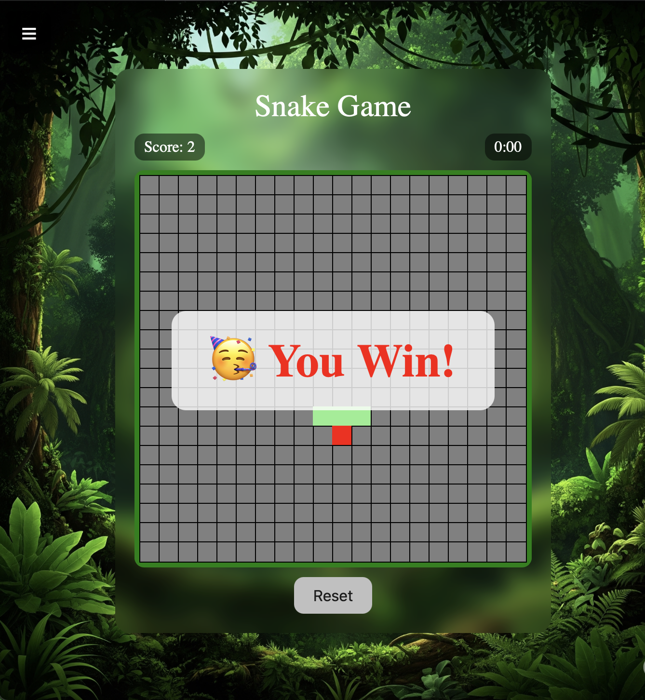

<h1 style="text-align:center;">Snake Game</h1>
<br>

# Decription 

***The Snake Game***

***A traditional Snake game created with HTML, CSS, and JavaScript.***

# Methods for Playing

***To move the snake, use the arrow keys (← ↑ → ↓).***
***Consume the food to gain points and length.***
***You lose if you strike the walls or the snake's body.***
# How to Run

***In your browser, open the index.html file.***
***Play now!***
***Documents***

***The game page is index.html.***
***The game code is in script.js, and the page styling is in styles.css.***


# Qualities

**keyboard arrows for responsive controls.**
**fluid movement of a snake.**
**score display in real time.**
**collision-based game over detection.**
**The user interface is clear and uncomplicated**

## all Features have been add for the Game : 
1- background Changeable\
2- timer make more challenges for the user\
3- showes all messages for the user if he win or lose\
4- when the user eat food increase the size of the snake\
5- when the user eat food the score also increase by 1 point\
6- modren ui/ux\
7- border containes 400 div styled by grid\
8- the snake generated randomely\
9- the food generated randomely \
10- adding drawer that containes button for each background


## How To play Game
1- open live server\
2- press any kind of arrow keys at keyboard that will move the snake\
3- try to eat many food as u can to get best score\
4- survive until the countdown finish to win the game

# Code Explaination 

## Variables and const
```js
let border = documement.getElementById("border");
let bornSnake = [{x:Math.floor(Math.random(*20),y:Math.floor())}]
```
***border it is where the snake move that contain 20*20 div grid area**
***bornSnake it is array contain each parts of snake [x: 10, y:10];***
***way that control direction for the snake***
*** ate gives random position by using Math.random**
```js
let border = document.getElementById('border');
let bornSnake = [{x: Math.floor(Math.random()*20), y: Math.floor(Math.random()*20)}];
let way = {x:0 , y:0};
let ate = {x: Math.floor(Math.random()*20), y: Math.floor(Math.random()*20)};
let score = document.querySelector(".score");
let reset = document.getElementById("reset-btn");
let time = document.querySelector(".timer");
let note = document.querySelector(".note");
let speed = document.querySelector(".btnspeed");
let slow = document.querySelector(".btnslow");
let bestEle = document.querySelector(".best");
let bestScore = parseInt(localStorage.getItem("best")) || 0;
let currentScore = 0;
let rem = 10;
let isRun = true;
let showover = false;
let isWin = false;
let game;
let timerInterval;
let numspeed = 200;
let designspeed = 1;
let designslow = 1;
bestEle.innerHTML = `Best Score : ${bestScore}`;
```
 ***rem timer value in sec***
 ***isRun determin whether game is running or not***
 ***showover,isWin that check if the user win or not to show their messages***

```js
 document.addEventListener("keyup", function(e) {
  if(way.x === 0 && way.y === 0) {
    if (!timerInterval) {
      timerInterval = setInterval(timing, 1000);
    }
    isRun = true;
    reset.classList.remove("hiddenbtn");
    note.classList.add("hiddenbtn");
  }

  if (e.key === "ArrowUp" && way.y !== 1 && isRun) way = {x:0,y:-1};
  else if (e.key === "ArrowDown" && way.y !== -1 && isRun) way = {x:0,y:1};
  else if (e.key === "ArrowLeft" && way.x !== 1 && isRun) way = {x:-1,y:0};
  else if (e.key === "ArrowRight" && way.x !== -1 && isRun) way = {x:1,y:0};
});
```
***that for changing direction for the snake***

```js
reset.addEventListener("click", function() {
  ate = {x: Math.floor(Math.random()*20), y: Math.floor(Math.random()*20)};
  bornSnake = [{x: Math.floor(Math.random()*20), y: Math.floor(Math.random()*20)}];
  way = {x:0 , y:0};
  score.innerHTML = "Score: 0";
  showover = false;
  isWin = false;
  isRun = false;
  rem = 10;
  time.innerHTML = "0:10";
  clearInterval(timerInterval);
  timerInterval = null;
  reset.classList.add("hiddenbtn");
  note.classList.remove("hiddenbtn");
  document.querySelector(".GameOver")?.remove();
  document.querySelector(".win")?.remove();
  littleSnake();
  clearInterval(game);
  game = setInterval(() => {
    if (isRun) {
      movingSnake();
      littleSnake();
      gameOver();
      uWin();
    }
  }, 200);
});
```
*** that code reset all var and timer the whole game**

```js
function updateScore(){
    let value = parseInt(score.innerText.split(":")[1]) || 0;
    currentScore = value;
    if(currentScore >bestScore){
        bestScore = currentScore;
        localStorage.setItem("best", bestScore);
        bestScore.innerHTML = `Best Score :${bestScore}`;
    }
}
```
***This code for storage best score between the users and show it in screen***

```js
speed.addEventListener("click", ()=>{
     numspeed = numspeed - 10;
     clearInterval(game);
        designspeed = designspeed + 1;
        speed.innerHTML = `Speed x${designspeed}`;
     game = setInterval(()=>{
        if(isRun === true){
            movingSnake();
            littleSnake();
            gameOver();
            uWin();
        }
     }, numspeed)
})
```
***That code for increase speed of snake***

```js
slow.addEventListener('click',()=>{
    numspeed = numspeed + 10;
    clearInterval(game);
    designslow = designslow + 1; 
    slow.innerHTML = `Slow x${designslow}`;
    game = setInterval(()=>{
            movingSnake();
            littleSnake();
            gameOver();
            uWin();
    },numspeed)
})
```

***That code for decrease speed of snake***

```js
function littleSnake() {
  border.innerHTML = "";
  for (let i = 0; i < 400; i++) {
    const block = document.createElement("div");
    block.classList = "block";
    let x = i % 20;
    let y = Math.floor(i/20);
    for (let j = 0; j < bornSnake.length; j++) {
      if (bornSnake[j].x === x && bornSnake[j].y === y) block.className = "snake";
      if (ate.x === x && ate.y === y && !checkFood()) block.className = "food";
    }
    border.appendChild(block);
  }
}
```
***that code create 400 div and give him class block and determin where the snake position after that give it className snake so it show the snake at border.***

```js
function movingSnake() {
  const head = { x: bornSnake[0].x + way.x, y: bornSnake[0].y + way.y };
  bornSnake.unshift(head);
  if (head.x === ate.x && head.y === ate.y) {
    ate = {x: Math.floor(Math.random()*20), y: Math.floor(Math.random()*20)};
    let value = parseInt(score.innerText.split(":")[1] || 0);
    score.textContent = `Score: ${value + 1}`;
    updateScore();
  } else {
    bornSnake.pop();
  }
}
```
***that draw the snake body while moving around the border at the same time when the user eat food it increase snake body by one part every time user eat and every time it increase socre by 1 after eat food.***

```js
function gameOver() {
  if (bornSnake[0].x < 0 || bornSnake[0].x >= 20 || bornSnake[0].y < 0 || bornSnake[0].y >= 20) {
    isRun = false;
  }
  for (let i = 1; i < bornSnake.length; i++) {
    if (bornSnake[i].x === bornSnake[0].x && bornSnake[i].y === bornSnake[0].y) {
      isRun = false;
      break;
    }
  }
```

***that function its like the rules of losing if the user hit the border it stop the game or he hit himself***

``` js
  if (!isRun && !showover) {
    let card = document.createElement("div");
    card.className = "GameOver";
    card.innerText = "Game Over!";
    document.body.appendChild(card);
    showover = true;
    reset.classList.remove("hiddenbtn");
  }
}
```
***that code for showing div inside it message Game Over if the user lose***

```js
function timing() {
  if (isRun && rem >= 0) {
    let min = Math.floor(rem / 60);
    let sec = rem % 60;
    time.innerHTML = `${min}:${sec < 10 ? '0' + sec : sec}`;
    rem--;
  } else {
    isRun = false;
  }
}
```

***that math calculation for countdown to determin if the user win before the time finish***

```js
function checkFood() {
  return bornSnake.some(part => part.x === ate.x && part.y === ate.y);
}
```

***that code give condition to give true if snake ate the food***

```js
function uWin() {
  if (time.innerHTML === "0:00" && !isWin) {
    isWin = true;
    let win = document.createElement("div");
    win.className = "win";
    win.innerHTML = "🥳 You Win!";
    document.body.appendChild(win);
    reset.classList.remove("hiddenbtn");
  }
}
```

***that code creating div and give it message You Win if the timer finish without hiting anything***

```js
// Drawer toggle
document.getElementById("toggleDrawer").addEventListener("click", () => {
  document.getElementById("drawer").classList.toggle("hiddenbtn");
});

// Change background image on click
document.querySelectorAll(".image-options img").forEach(img => {
  img.addEventListener("click", () => {
    const bg = img.getAttribute("data-bg");
    document.body.style.backgroundImage = `url('${bg}')`;
  });
});

// Initialize the game on page load
littleSnake();  // Draw initial state

// Start the game loop but don't move snake until key pressed
game = setInterval(() => {
  if (isRun) {
    movingSnake();
    littleSnake();
    gameOver();
    uWin();
  }
}, numspeed);
```
*** first function for changing background**
**the second function for running the code every 2 second**

# Screen Shote for the all features 

# 1 Main Screen


# 2 showing win message feature


# 3 showing lose message feature


# 4 showing drawer feature


# 5 after changing the background


# 6 after adding speed and slow button for snake speed 


# 7 after adding LocalStorage for see best score between users 

